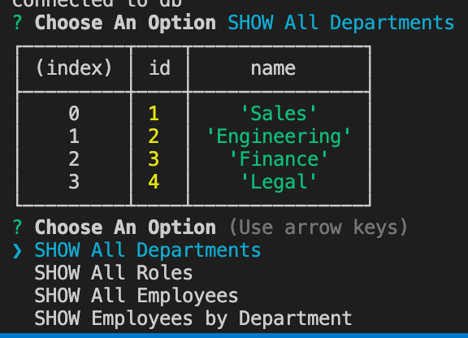
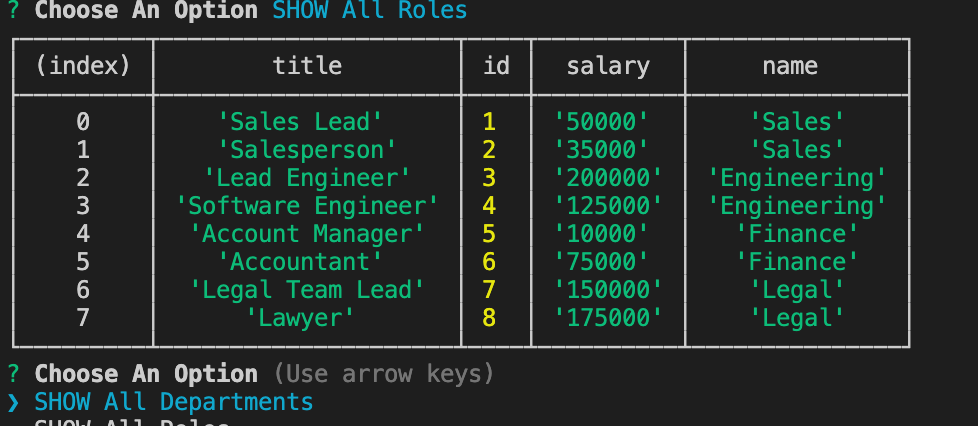

# Employee-Tracker

## Description
This project was created in order for a user to keep track of their employees. As well as there roles within their company and the salary they are getting payed. It will create a database that can be dynamically updated using inquirer with the ability to add and delete employees based on there status at the company.

## User Story
```md
AS A business owner
I WANT to be able to view and manage the departments, roles, and employees in my company
SO THAT I can organize and plan my business
```

## Installation

[Clone the repo] (https://github.com/carsonccu/Employee-Tracker)

Install dependencies
```
npm i
```
```
mysql -u root -p
```
Enter password run the below command to initiliaze the database
```
SOURCE schema.sql || SOURCE seeds.sql
```
Start the application with the below command:
```
node index.js
```
## Video

## Screenshot



## Links
* https://github.com/carsonccu/Employee-Tracker